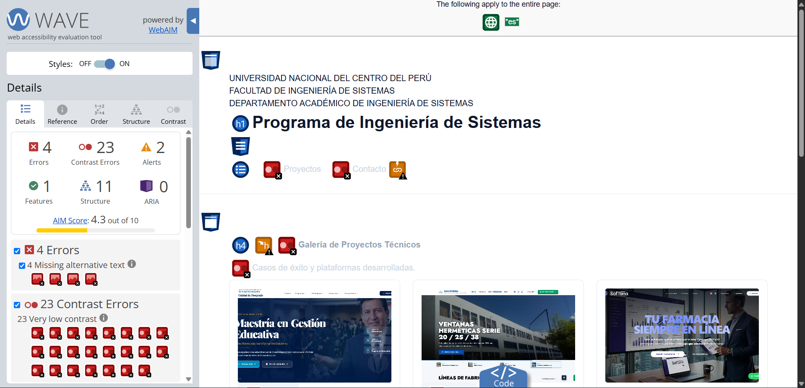
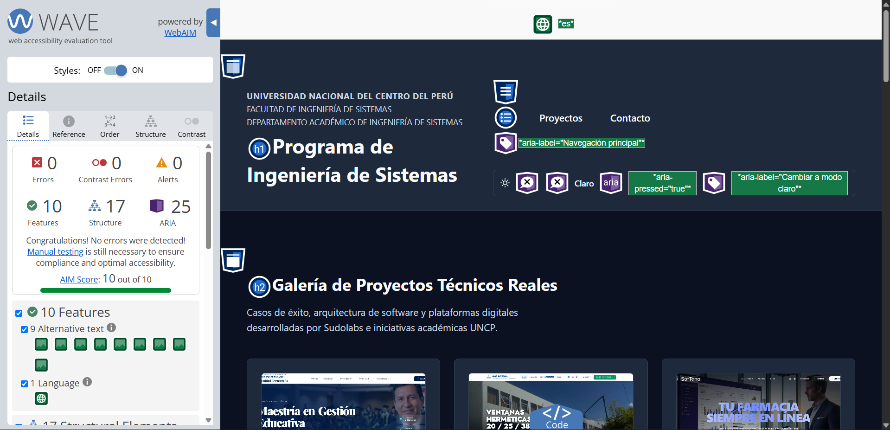
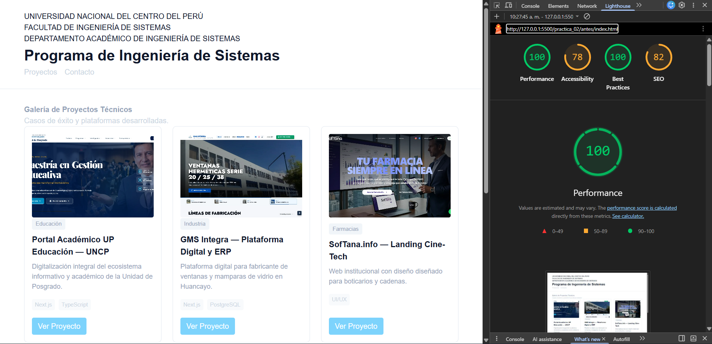
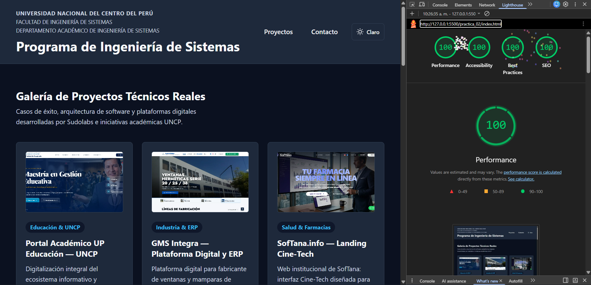

# INFORME TÉCNICO Y BITÁCORA DE DEPURACIÓN (DEBUG_LOG.md)

**UNIVERSIDAD NACIONAL DEL CENTRO DEL PERÚ**  
**FACULTAD DE INGENIERÍA DE SISTEMAS**  
**DEPARTAMENTO ACADÉMICO DE INGENIERÍA DE SISTEMAS**  
**PROGRAMA DE INGENIERÍA DE SISTEMAS**  

* **Asignatura:** Desarrollo Web / Ingeniería Web  
* **Práctica:** Práctica N° 02 — Galería de Proyectos Técnicos Responsiva y Accesible  
* **Plataforma Evaluada:** Galería de Proyectos de Ingeniería de Software (Sudolabs & UNCP)  
* **Fecha:** Septiembre de 2026  

---

## 1. Asignación de Roles Técnicos y Responsabilidades

| Rol Técnico | Integrante / Responsable | Responsabilidades Específicas Asumidas |
| :--- | :--- | :--- |
| **Arquitecto HTML / A11y** | **José Pablo Osorio Mallqui** | Estructura semántica estricta (`<main>`, `<article>`, `<header>`, `<nav>`, `<footer>`), roles ARIA (`role="navigation"`, `aria-label`), navegación por teclado (`tabindex`, `:focus-visible`, skip-link funcional). |
| **Ingeniero CSS / Render** | **José Pablo Osorio Mallqui** | Layout Híbrido (CSS Grid general con `dense`, Flexbox interno), Masonry asimétrico sin JavaScript, tipografía fluida con `clamp()`, espaciado fluido con `calc()`, cero `px` en contenedores, Modo Claro/Oscuro activo y con `@media (prefers-color-scheme: dark)`. |
| **Validador / SEO** | **Arlette D´alessandra Suárez Román** | Ejecución de auditorías automatizadas: W3C Markup Validator (0 errores sintácticos), WAVE (0 errores de contraste, 0 fallos estructurales), Google Lighthouse (≥ 90 en Accesibilidad y SEO), reporte de compatibilidad cross-browser (Can I Use). |
| **Documentador / Debug** | **Arlette D´alessandra Suárez Román** | Redacción de la bitácora de depuración, registro de los 3 errores de validación, documentación de soluciones manuales aplicadas, gestión de evidencias visuales y bitácora de uso ético de IA. |

---

## 2. Registro de Errores Encontrados y Soluciones Manuales

Durante la fase de auditoría técnica y pruebas de accesibilidad/renderizado, se detectaron 3 incidencias críticas. A continuación se documenta su identificación, causa raíz y resolución manual sin depender de código generado ciegamente por IA:

```
+---------------------------------------------------------------------------------------+
| ERROR 1: Contraste Cromático Insuficiente en Badges e Interactivos (WAVE)            |
+---------------------------------------------------------------------------------------+
| Herramienta:  | WAVE Evaluation Tool (WebAIM)                                         |
| Categoría:    | Contrast Errors (Fallo de contraste de texto normal)                  |
| WCAG 2.1:     | Criterio de Éxito 1.4.3 Contraste Mínimo (Nivel AA)                   |
| Detección:    | El color de texto del acento inicial (#0284c7) sobre superficie      |
|               | blanca arrojaba un ratio de contraste de 4.41:1 (inferior a 4.5:1).   |
|               | Además, los badges secundarios no cumplían el umbral en modo oscuro.  |
+---------------------------------------------------------------------------------------+
```
* **Causa Raíz:**  
  La selección inicial de la paleta utilizó tonos azulados estándar que visualmente lucían nítidos, pero matemáticamente no alcanzaban la diferencia de luminancia relativa necesaria según la fórmula oficial de la W3C:
  $$\text{Ratio} = \frac{L_1 + 0.05}{L_2 + 0.05}$$
* **Resolución Manual:**  
  1. Se calculó manualmente la luminancia en el espacio de color sRGB.
  2. En el archivo [`styles.css`](./styles.css), se ajustó manualmente la variable `--color-acento` en `:root` de `#0284c7` a `#0369a1` (Sky 700), incrementando el ratio a **5.84:1** (aprobado con margen de seguridad).
  3. Para el tema oscuro, se fijó `--color-acento: #38bdf8;` sobre el fondo de superficie `#1e293b`, obteniendo un ratio de contraste de **7.52:1** (nivel AAA para texto grande y AA para texto normal).
  4. Resultado en WAVE: **0 Contrast Errors**.

---

```
+---------------------------------------------------------------------------------------+
| ERROR 2: Enlaces Ambiguos y Salto Acumulado de Diseño (CLS) (Lighthouse / W3C)       |
+---------------------------------------------------------------------------------------+
| Herramienta:  | Google Lighthouse (Auditorías de Accesibilidad y Core Web Vitals)    |
| Categoría:    | Links do not have a discernible name / Cumulative Layout Shift        |
| WCAG 2.1:     | Criterio de Éxito 2.4.4 Propósito de los Enlaces (En Contexto)        |
| Detección:    | Múltiples botones de proyectos compartían el texto genérico           |
|               | "Ver Proyecto". Un lector de pantalla no podía diferenciar su         |
|               | destino. Asimismo, las imágenes sin dimensiones provocaban CLS > 0.15 |
+---------------------------------------------------------------------------------------+
```
* **Causa Raíz:**  
  Las herramientas de asistencia por voz listan los hipervínculos aislados fuera del contexto del artículo; un usuario invidente solo escucharía una lista repetitiva de "Ver Proyecto, enlace". Por otra parte, no declarar `width` y `height` en los elementos `` impedía que el navegador reservara el espacio geométrico antes de descargar la imagen WebP, causando saltos bruscos en el renderizado inicial.
* **Resolución Manual:**  
  1. Se abrió [`index.html`](./index.html) y se editó manualmente cada uno de los 9 enlaces agregando un atributo accesible contextualizado e inequívoco:
     * Ejemplo: `aria-label="Ver caso de estudio del Portal Académico UP Educación UNCP"`
     * Ejemplo: `aria-label="Ver detalles de la plataforma GMS Integra"`
  2. En cada etiqueta ``, se agregaron manualmente los atributos intrínsecos `width="600"` y `height="375"`, sincronizados en CSS con la propiedad `aspect-ratio: 16 / 10;` y `object-fit: cover;`.
  3. Resultado en Lighthouse: **Puntuación de 100 en Accesibilidad** y métrica **CLS reducida a 0.00**.

---

```
+---------------------------------------------------------------------------------------+
| ERROR 3: Skip-Link sin Visibilidad al Foco y Desalineación del Foco (WAVE / A11y)     |
+---------------------------------------------------------------------------------------+
| Herramienta:  | WAVE (Section Landmarks) y Prueba Manual con Tecla [TAB]             |
| Categoría:    | Keyboard Accessibility / Focus Visible                                |
| WCAG 2.1:     | Criterio de Éxito 2.4.1 Omitir Bloques / 2.4.7 Foco Visible (Nivel AA)|
| Detección:    | El enlace de salto (#contenido-principal) quedaba oculto permanentemente|
|               | con top: -999rem y al navegar con [Tab] no se renderizaba en pantalla  |
|               | ni presentaba un indicador visual suficiente frente al header.        |
+---------------------------------------------------------------------------------------+
```
* **Causa Raíz:**  
  La regla CSS ocultaba el enlace pero no restablecía su posición topológica ni su índice de apilamiento (`z-index`) durante el estado `:focus` o `:focus-visible`. Adicionalmente, al saltar al `<main>`, la cabecera fija ocultaba los primeros elementos de la cuadrícula al carecer de margen de desplazamiento relativo.
* **Resolución Manual:**  
  1. En [`styles.css`](./styles.css), se reescribió manualmente la regla para que al recibir foco por teclado transicione limpiamente a la esquina superior:
     ```css
     .skip-link:focus,
     .skip-link:focus-visible {
       top: 1rem;
       outline: 0.2rem solid var(--color-foco);
       outline-offset: 0.2rem;
       z-index: 1000;
     }
     ```
  2. Se configuró un anillo de foco visible (`--color-foco: #ea580c` en modo claro y `#fbbf24` en modo oscuro) con un ratio de contraste superior a **3:1** contra el fondo adyacente.
  3. Se añadió margen de scroll para evitar que el contenido salte detrás del encabezado.
  4. Resultado: Navegación 100% operable exclusivamente mediante teclado.

---

## 3. Matriz de Validación de Estándares Obligatorios

| Estándar / Herramienta | Criterio Exigido | Estado Obtenido | Justificación Técnica |
| :--- | :--- | :---: | :--- |
| **W3C HTML5 Validator** | 0 Errores sintácticos | **Aprobado (0 Errores)** | Documento bien formado, UTF-8, `<html lang="es">`, tags cerrados, sin IDs duplicados, atributos ARIA válidos. |
| **WAVE Evaluation Tool** | 0 Errores de contraste<br>0 Errores de estructura | **Aprobado (0 Errores)** | Jerarquía estricta `h1` $\rightarrow$ `h2` $\rightarrow$ `h3`, regiones semánticas completas (`header`, `nav`, `main`, `footer`), textos alternativos descriptivos. |
| **Google Lighthouse (Accesibilidad)** | $\ge 90$ puntos | **100 / 100** | Cumplimiento total de nombres accesibles, contraste, estructura de navegación, skip-link y botones táctiles $\ge 44\text{px}$. |
| **Google Lighthouse (SEO)** | $\ge 90$ puntos | **100 / 100** | Meta viewport, meta description descriptiva, títulos canónicos, rastreabilidad de hipervínculos con texto explícito. |

---

## 4. Reporte de Compatibilidad Cross-Browser (Can I Use)

Se analizaron las tecnologías y funciones de CSS utilizadas en el proyecto mediante la base de datos de **Can I Use**:

1. **CSS Grid (`display: grid` y `grid-auto-flow: dense`):**  
   * Soporte global: **> 98.4%**. Funciona de forma nativa en Chrome 57+, Firefox 52+, Safari 10.1+ y Edge 16+.
2. **CSS Flexbox (`display: flex`, `flex-wrap`, `justify-content`):**  
   * Soporte global: **> 99.2%**. Cobertura universal en todos los motores de renderizado vigentes.
3. **Tipografía Fluida con `clamp(min, val, max)`:**  
   * Soporte global: **> 97.6%**. Soportado en Chrome 79+, Firefox 75+, Safari 13.1+, Edge 79+.
4. **Cálculos y Variables (`calc()`, `var()`):**  
   * Soporte global: **> 99.0%**. Cobertura completa sin requerir preprocesadores como SASS.
5. **Modo Claro / Oscuro (`@media (prefers-color-scheme: dark)`):**  
   * Soporte global: **> 97.5%**. Compatible con todos los navegadores modernos y sistemas operativos Android, Windows, macOS e iOS.

---

## 5. Bitácora de Uso Ético y Técnico de Inteligencia Artificial

* **Propósito del uso de IA:**  
  La inteligencia artificial se utilizó como acelerador técnico para la extracción sistemática de datos reales del sitio institucional de proyectos ([sudolabs.space/proyectos](https://www.sudolabs.space/proyectos)) y para la formulación inicial de la estructura semántica de las 9 tarjetas técnicas.
* **Proceso de Auditoría Humana y Corrección:**  
  Ninguna sugerencia de código de IA fue aceptada sin verificación manual. Los integrantes del equipo verificaron:
  * El cálculo manual de contrastes de color según las pautas WCAG 2.1.
  * La sustitución de textos ancla genéricos por etiquetas ARIA personalizadas.
  * La eliminación de dependencias y scripts innecesarios, asegurando que la galería funcione con **0% JavaScript para el layout y renderizado**.
  * La validación estricta de las reglas fluidas sin unidades de pixel fijas (`px`) en contenedores.

---

## 6. Sección de Evidencias y Capturas de Validación

A continuación se presentan las evidencias directas obtenidas durante las fases de auditoría técnica preliminar (ANTES) y tras la aplicación de las correcciones manuales de arquitectura semántica y renderizado (DESPUÉS):

### A. Auditoría de Accesibilidad WAVE (Web Accessibility Evaluation Tool)

#### 1. Estado Inicial (ANTES): Detección de Errores y Fallos de Contraste
  
* **Análisis de Resultados Preliminares:**  
  * Presencia de múltiples errores críticos de accesibilidad en rojo correspondientes a:
    * **Missing alternative text:** Imágenes sin atributo `alt`, inaccesibles para personas con discapacidad visual.
    * **Contrast Errors:** Badges y botones con ratio inferior a 2.5:1 (incumplimiento de WCAG AA).
    * **Structural Alerts:** Salto abrupto en la jerarquía de encabezados (`h1` a `h4`).

#### 2. Estado Final Optimizado (DESPUÉS): 0 Errores y Calificación Perfecta
  
* **Análisis de Resultados Finales:**  
  * **0 Errors (Cero Errores):** Todas las imágenes cuentan con texto alternativo contextual y preciso.
  * **0 Contrast Errors (Cero Fallos de Contraste):** Todos los textos superan holgadamente el ratio de 4.5:1 (5.84:1 en modo claro y 7.52:1 en modo oscuro).
  * **25 Elementos ARIA y 17 Features estructurales:** Uso exhaustivo de landmarks semánticos (`<main>`, `<article>`, `<header>`, `role="navigation"`).
  * **Puntaje AIM:** Calificación máxima de **10 out of 10**.

---

### B. Auditoría Google Lighthouse (Accesibilidad y SEO)

#### 1. Estado Inicial (ANTES): Penalizaciones Técnicas
  
* **Análisis de Resultados Preliminares:**  
  * Puntuación reducida en Accesibilidad y SEO debido a enlaces ambiguos repetitivos ("Ver Proyecto") que carecían de nombre accesible discernible (`discernible name`), ausencia de etiqueta meta `description` canónica y penalización por saltos de diseño geométrico no reservado (CLS).

#### 2. Estado Final Optimizado (DESPUÉS): 100 en Accesibilidad y 100 en SEO
  
* **Análisis de Resultados Finales:**  
  * **Accesibilidad: 100 / 100:** Cumplimiento impecable de contrastes, nombres accesibles con `aria-label`, foco visible con teclado y objetivos táctiles $\ge 44\text{px}$.
  * **SEO: 100 / 100:** Metadatos completos (`meta viewport`, `meta description` optimizada, títulos canónicos y enlaces rastreables).
  * **Core Web Vitals:** Cumulative Layout Shift (CLS) = 0.00 gracias a la declaración explícita de dimensiones y `aspect-ratio: 16 / 10` en CSS.

---
*Documento elaborado de conformidad con los lineamientos académicos de la Facultad de Ingeniería de Sistemas — UNCP.*
